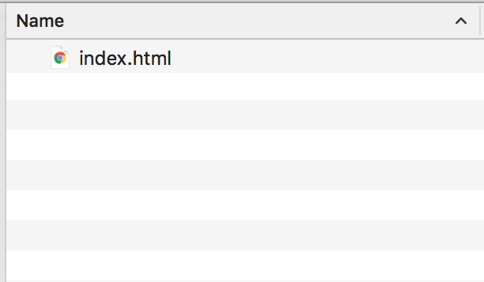
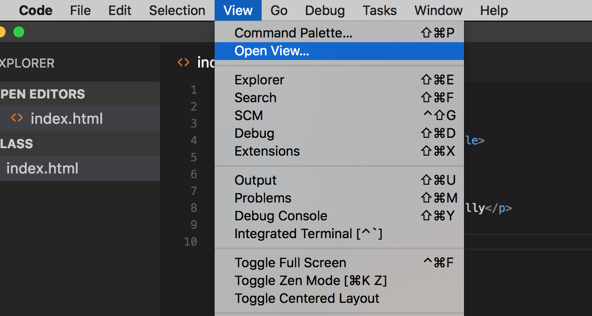
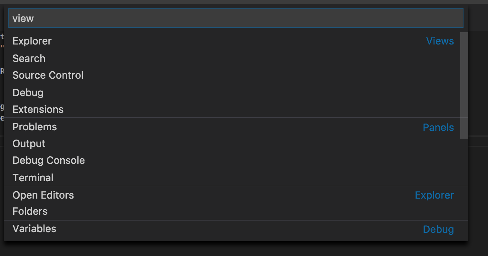
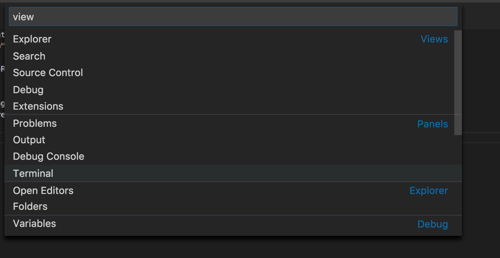

# Browser API

[<- Go Back](README.md)

# http-server
* **http-server** is a simple, zero-configuration command-line http server
* It is powerful enough for production usage, but it's simple and hackable enough to be used for testing, local development, and learning
* We're going to install http-server locally
* If you have Node.js installed execute the following command from your terminal

```bash
npm install http-server -g
```

* We create an HTML file like always


* Usually you just double click the file



* And open it on a browser


* Now we are going to use the Visual Studio Code terminal
* Go to the main bar and select View > Open View



* You will see a couple of options



* Select the Terminal



* You will see the terminal view inside VSC
* If you opened the folder VSC already knows that we're using this path
* Type:
```bash
http-server
```
* A new web server will start
* This server will serve the folder files
* So our site root is going to be our folder that we are using
* If everything is ok you see a message
* By default this server will run on port `8080`
* The port might change if you already have that port listening with other app


* Now open the browser again
* Navigate to `http://localhost:8080`
* At this moment you must see your index.html document


* Using http-server we have a local server running and we are able to simulate a real site
* From now on use http-server or similar to create your sites
* If you need to stop the server just press `CTRL + C`
* You can open the terminal using the following shorcut
```
Ctrl+` 
```

* [http-server site](https://www.npmjs.com/package/http-server)
* [VSC keyboard shortcuts Windows](https://code.visualstudio.com/shortcuts/keyboard-shortcuts-windows.pdf)
* [VSC keyboard shortcuts Mac](https://code.visualstudio.com/shortcuts/keyboard-shortcuts-macos.pdf)

## How to execute JavaScript
* Using the browser we can execute JavaScript in the following ways:
  * Console
  * Inside script tag
  * External file using script tag
  
### Script Tag
* The HTML **script element** is used to embed or reference executable code
* Typically used to embed or refer to JavaScript code
* The script element can also be used with other languages, such as WebGL's GLSL shader programming language
* You can add the script tag inside the head element
* Also, you can add your script tag right before closing the body element
* The script tag and the way we load/execute our JavaScript can have some browser effects
* For now just know that you can place it in both elements (head & body)

**Example:**
```html
<head>
  <script>
    // You can add your JavaScript code here!
    console.log('Wellcome to the Browser again!!');
  </script>
</head>
```

* Or

**Example:**
```html
<body>
  <h1>Hi</h1>
  <p>Add the script tag</p>
  
  <script>
    // You can add your JavaScript code here!
    console.log('Wellcome to the Browser again!!');
  </script>
</body>
```

#### Practice
[Exercise 1](./exercises/browser/ex_1.md)

### External file using script tag
* Using a **script tag** we can link our HTML file with a JavaScript one
* This is going to work in a similar way as the CSS files and the link tag
* Using the script tag `src` attribute we can set the external file value

**Example:**
* HTML code:

```html
<head>
  <script src="script.js"></script>
</head>
```

* Code inside the `script.js` file
```js
// archivo script.js
console.log('Wellcome to the browser');
```

* When the browser finds a **script** tag will request the js file, download it and then execute it
* While this happens the browser is blocked from being able to keep on rendering the document
* This is one of the reasons why we use the script tag before the closing body one
* By doing this we show the HTML content and then execute the script
* Now the browsers supports `async` & `defer` attributes that allows us to tell the browser how it has to handle our script files

**Example:**
```html
<head>
  <script src="script.js" async></script>
</head>
```
* Or

**Example:**
```html
<head>
  <script src="script.js" defer></script>
</head>
```

* These attributes tell the browser it's safe to continue parsing while the scripts are being downloaded
* Scripts with the `async` attribute are executed asynchronously
* This means the script is executed as soon as it's downloaded, without blocking the browser in the meantime
* This implies that it's possible that a second script is downloaded & executed before the first script
* Scripts with the `defer` attribute are executed in order (i.e. first script, then second and so on)
* Also does not block the browser
* Unlike async scripts, defer scripts are only executed after the entire document has been loaded
* You can learn more about async and defer on the following links
  * [Adding interactivity with JavaScript](https://developers.google.com/web/fundamentals/performance/critical-rendering-path/adding-interactivity-with-javascript)
  * [async vs defer](http://www.growingwiththeweb.com/2014/02/async-vs-defer-attributes.html)
  * [async vs defer - Video](https://www.youtube.com/watch?v=cCrfL84DkEk)

#### Practice
[Exercise 2](./exercises/browser/ex_2.md)

## User interaction
* Browsers have a **window** object that represents a window containing a DOM document
* This object has 3 methods that allows use to interact with the user: `alert, prompt & confirm`
* The browsers have allready configured a reference so we can call this methods without the window object
* All this methods block the browser flow until they are resolved

**Example:**
```js
// Methods call using windows object:
window.alert();
window.prompt();
window.confirm();

// Using them as functions:
alert();
prompt();
confirm();
```

### Alert
* The **Window.alert()** method displays an alert dialog with the optional specified content and an OK button
* This method accepts a message parameter that will show to the user

**Example:**
```js
window.alert('Hi I\'m using the browser');
alert('How cool is that!!');
```

* [MDN alert doc](https://developer.mozilla.org/en-US/docs/Web/API/Window/alert)

#### Practice
[Exercise 3](./exercises/browser/ex_3.md)

### Prompt
* The **Window.prompt()** displays a dialog with an optional message prompting the user to input some text
* This method accepts 2 parameter
* First parameter is the message that we'll show the user
* Second parameter is optional and is the input default value
* This method returns a `string` value

**Example:**
```js
let name = window.prompt('Please input your name');
let superHeroe = prompt('Please input your favourite superheroe name');
```

* [MDN prompt doc](https://developer.mozilla.org/en-US/docs/Web/API/Window/prompt)

#### Practice
[Exercise 4](./exercises/browser/ex_4.md)

[Exercise 5](./exercises/browser/ex_5.md)

### Confirm
* The **Window.confirm()** method displays a modal dialog with an optional message and two buttons, OK and Cancel
* This method accepts a string parameter that will show to the user
* This method returns a `boolean` value
* If the user press Ok we get `true` back
* Else we get `false` back

**Example:**
```js
let isAdult = window.confirm('Are you older than 17 years?');
confirm('Are you older than 17 years?');
```

* [MDN confirm doc](https://developer.mozilla.org/en-US/docs/Web/API/Window/confirm)

#### Practice
[Exercise 6](./exercises/browser/ex_6.md)

[Exercise 7](./exercises/browser/ex_7.md)

[Exercise 8](./exercises/browser/ex_8.md)

* [MDN script tag doc](https://developer.mozilla.org/en-US/docs/Web/HTML/Element/script)

## Assets / Resources
https://frontendmasters.com/books/front-end-handbook/2018/